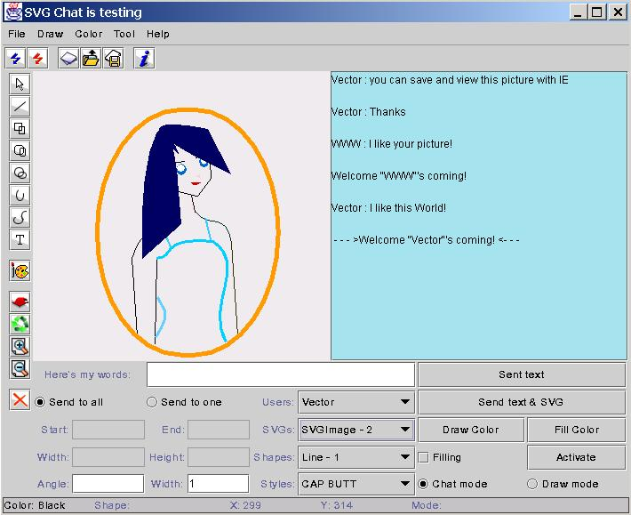

# SVGChat
# Vector Graphics Chat Rooms(In 2002)

This one. The Java project, called "SVG Chat", is architecturally a C/S-mode-based chat room, but what sets her from the network is that the graphical objects she transmits between networks are based on XML specifications. SVG(transformable vector graphics). Therefore, in addition to providing a multi-user, multithreaded network architecture, the system can generate standard SVG documents and use SAX to parse XML documents. Because of the power of Java2D, the author finds it very convenient to draw graphics.

The following is the operating interface of the system's clients, which the author will use as an example to give you some necessary explanations:

In the use of this system, basically do not need to menu to complete all functions. All toolbar buttons display a feature prompt. As a potential Terminator of Flash,SVG provides powerful vector graphics drawing, manipulation capabilities, and support for sound, animation, and event response. However, since the design objective of this system is only an interactive teaching system for computer graphics, and the author's personal capacity is limited, only the SVG document generated by the system itself can be identified, but the resulting SVG document can be generated in any standard SVG Used in the tour. This system will appear in the "Huazhong University of Technology" (now renamed "Huazhong University of Science andTechnology") Lu Feng teacher's upcoming "Graphics" textbook attached to the CD-ROM.

## First, operating instructions
### 1. Graphic drawing
    A column of toolbar buttons portraitd, drawing "straight lines", "rectangles" and "rounded rectangles" from the second one, respectively. Ellipse, Arc, Cube, and Text ". Note That the system uses lock mode, and once one of the above buttons is selected, it will remain in effect until the other drawing buttons are re-selected or the first "Select" in the portrait toolbar enters the operating mode of the drawn drawing. In this mode test will not draw any graphics, but only according to the position and level of the mouse to make the selection of graphics, for the selected graphics will appear control points, you can click to drag, change the shape of the graphic;

    In the process of drawing a graphic, in addition to "text" only need to click the mouse, other vector graphics need to hold down and drag the mouse to produce the graphic. Note That once a drawing is drawn, you want to change its shape or position immediately, select the Select button, or click the mouse to draw a new drawing.

    For the two round angles ofthe Fillet Rectangle, the font and content of the "text", as well as the starting angle and arc of the arc, should be at the bottom of the client program after the drawing is completed. Click the "Activate" button in the control area and set it in the dialog box.

### 2. Color selection
    Before drawing any graphic, the user can anticipate the colors they use, using the Palette button son in the Color menu or portrait toolbar to set the relevant settings, otherwise the default is black.

    After the drawing is complete, if you want to change the color, you should click the Draw Color button in the Control Area. To fill the graphic, select the "Filling" check box in Control Area, which defaults to white, and if you want to change it, click Control Zone The "Fill Color" button in .

### 3. Select Drawn Graphic
    Because it is a hierarchical relationship in each drawn drawing, the "Select" (first button) in the portrait toolbaris sometimes not selected for a drawing placed below the other graphics, in which case the control area should be used The "Shapes" drop-down list in makes a selection of the corresponding graph. Then click the penitentitybutton in the portrait toolbar (the "Move" function) and drag the mouse in the drawing area, dragging the overwritten graphic out of the covered area before moving back to the position.

### 4. Delete drawn graphics
    For a drawing that you've already drawn, if you're not satisfied, you can select it and then click the last button in the portrait toolbar to delete it.
    
### 5. Rotate, zoom in, zoom out and line width
    The second,third, fourth button in the portrait toolbar implements the relevant operation on the selected graphic. Zooming in and out requires a button to scale 10% of the selected graphic, and the angle of rotation is entered in Angle in the Control Area. The line width of the drawn drawing should be entered in "Width" in the Control Area.

### 6. Network operations
    If you want to contact another user, you should run on a computer on your network SVGChatServer. After confirming that the server is turned on, clicking the first button from the left on the landscape toolbar will bring up a dialog box asking for the server address, port number, and user name, noting that if the user name you entered is already occupied by another user, the system will request a new user name.

    If you want to disconnect the network, you can click the second button from the left on the landscape toolbar, or close the client application.

    If you send only text to all other users, enter the car after entering the text in the "Here's my words:" text box or tap "Send text" in "Control Area" button, or to transfer the current drawing board, click the Send text and SVG button. Note that the use of both buttons requires the text box to be empty.

### 7. Drawing board and file operation
    In the application run, if you want to open a new picture board, you can click on the third button from the left on the landscape toolbar, the picture board passed over by the network user and the new drawing board will be placed as the current drawing board, if you want to select the previous drawing board, "control area" The "SVGs" drop-down list in the corresponding drawing board is selected.

    To save the current drawing board as For sVG files, click the fifth button from the left on the landscape toolbar, enter the file name in the file dialog box, and note that ".svg" is used as the file name suffix.

    To load previously saved For sVG files, click the fourth button from the left on the landscape toolbar and select the file name in the file dialog box. I've already included two SVG files in the app pack so you can load it for a try.

    girl.svg And all.svg

　

## Second, the problem description
### 1. Arc Color
    Because of the The arc parameters of the SVG standard are different from those used in Java 2D, so the author has difficulty in implementing and solves the problem by using an alternative method, but the problem is that its color parameters are occupied and cause color distortion. I'll be on the internet provider's entire source code, hoping someone can solve the problem.

### 2. List of users
The Users drop-down list in the Control Area should be updated when a new user joins, but ArrayList is shaped after it is transferred over a network object. This means that only the list of users who joined for the first time can always be displayed. Is it the result of Java auto-optimization? Or for something else? I hope someone can answer.

### Other issues
    As an interactive teaching system of computer graphics, the function of this system may be enough, but also need a lot of testing, hope that conditional friends can apply it to practice, only in this way, will put forward new proposals and constantly improve.

    If you want to Browse the SVG vector graphics files in IE, install the IE plug-in for SVGView3, which can be downloaded on Adobe's corporate web page. When opened in IE, the graphic may appear in the lower left corner and may be out of screen range, so maximize the IE window and zoom in and out with right-click controls.

    How to run:

1. Unzip svgChat?Release?20020329.zip into a directory.
2. Run client:start java - jar SVGChatClient.jar
3. Run server:start java -jar SVGChatServer.jar

    Note: If you prefer, you can build two batch files, double-click, or install J2RE1.3.1 above. JDK doesn't have to remind you to install it.

    I hope you can make suggestions to me about this system, thank you very much!

2002.3.29 - Shenzhen
　
